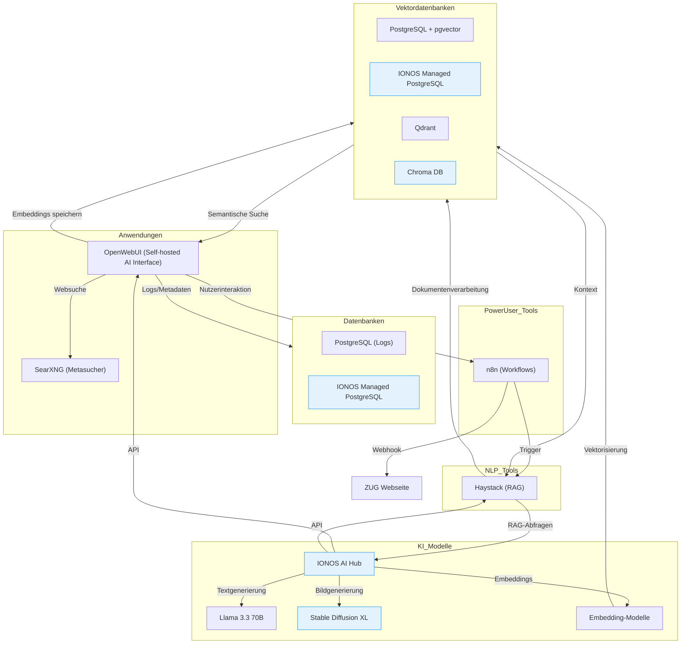

product: fehlt noch postgresql für openwebui

function KI workflow: ist die derzeitige function pipe zwischen openwebui und n8n. kann so wie sie ist in der openwebui oberfläche uner Admin panel--> Funktionen importiert werden. Die Variablen / vaults müssen dann noch ggf. angepasst werden auf deine jeweilige n8n instanz

n8n_RAG_ionos_Openwebui: kann direkt so in n8n reingeladen werden. musst natürlich die credentials anlegen

Bei Verwendung weiterer Frameworks müssen wir gucken das Nutzung kommerziell möglich (findet man im jeweiligen repo unter lizenz). 

### Systemlandschaft

# Inhalt
## Inhalt 1
1. [Systemlandschaftsbeschreibung der KI Infrastruktur](#systemlandschaftsbeschreibung-der-ki-infrastruktur)

## Systemlandschaftsbeschreibung der KI Infrastruktur
### Hardware-seitige Infrastruktur
* Siehe Leistungsbeschreibung KI-Infrastruktur.
* Es handelt sich um übliche Cloud-Ressourcen/virtuelle Maschinen.
* Diese dienen für die selbstgehosteten Services unten gelistet.
* Die Auflistung ist soweit vollständig, nicht alles wird im ersten Schritt benötigt.

### Softwareseitige Infrastruktur
* Fokus auf neue, KI-relevante Komponenten ohne Blick auf Sicherheitskomponenten oder Active Directories etc.

#### ZUGChat: OpenWebUI (Self-hosted AI Interface)
**Was es ist:**  
Docker-basierte Weboberfläche für LLMs-Interaktion.
**Einsatzgebiet:**  
Datenschutzkonformer ChatGPT-Ersatz für interne Teams.
**Datenströme:**
*   **Rein:** Nutzerprompts (Text/PDF)
*   **Raus:** Generierte Texte/Zusammenfassungen

**Verarbeitung:**
*   Integriert lokale/Cloud-LLMs
*   LangChain-Unterstützung für RAG4

**Zugang:**
*   Endnutzer via Web-Login
*   Admins für Rollenmanagement

**Lizenz:**
*   [BSD-3-Clause-basiert, mit Branding-Schutz](https://docs.openwebui.com/license/)

**Personenbezogene Daten:**
*   Nutzerprompts mit sensiblen Inhalten
*   Chatverläufe mit personenbezogenen Aussagen

#### IONOS AI Hub (API Endpoint)
##### Sprachmodelle
**Was es ist:**  
Serverlos bereitgestellter, leistungsstarker Sprachmodell-Endpunkt aus dem IONOS AI Model Hub.
**Einsatzgebiet:**  
Automatisierte Textgenerierung, semantische Suche, RAG-Workflows, Chatbots und KI-gestützte Analyse in Cloud-Umgebungen.
**Datenströme:**
*   **Rein:** Prompts (Textanfragen), ggf. Kontextdaten aus Vektordatenbanken
*   **Raus:** Generierte Antworten, Texte, Zusammenfassungen

**Verarbeitung:**
*   Serverloses Hosting und automatische Skalierung durch IONOS
*   Keine Speicherung der Prompts oder Nutzungsdaten für Trainingszwecke laut Anbieter
*   Anbindung über REST-API (OpenAI-kompatibel)

**Zugang:**
*   Entwickler und Anwendungen über API-Key
*   Integriert in Workflows von n8n, OpenWebUI, Haystack etc.

**Lizenz:**
*   [Nutzungsbedingungen und Datenschutzrichtlinien von IONOS AI Model Hub](https://cloud.ionos.com/managed/ai-model-hub)

**Löschfristen:**
*   Prompt- und Nutzungsdaten werden laut Anbieter nicht persistent gespeichert; etwaige Protokolldaten sollten spätestens nach 30 Tagen gelöscht oder anonymisiert werden.

**Personenbezogene Daten:**
*   Potenziell in Prompts enthaltene PII (Namen, Kontaktdaten)
*   Keine Speicherung laut Anbieter, aber temporäre Verarbeitung möglich

##### Embedding Modelle
**Was es ist:**  
Serverlos bereitgestellte, hochperformante Embedding-Modelle im IONOS AI Model Hub zur Generierung numerischer Vektoren aus Text.
**Einsatzgebiet:**
*   Semantische Suche in unstrukturierten Dokumenten
*   Vorverarbeitung für RAG-Workflows
*   Clustering und Klassifizierung von Texten
*   Erstellung von Vektoreinbettungen für KI-Modelle

**Datenströme:**
*   **Rein:** Rohtext (bis zu 8.192 Token) oder Dokumente
*   **Raus:** Vektoren (Float-Listen) mit bis zu 1024 Dimensionen

**Verarbeitung:**
*   OpenAI-kompatible REST-API für Embedding-Generierung
*   Automatische Skalierung und Tokenisierung
*   Unterstützung von 100+ Sprachen (BAAI M3)
*   Integration in Vektordatenbanken (z.B. Chroma DB) für RAG

**Zugang:**
*   Entwickler über API-Key (kostenfrei bis 30.06.2025, danach $0/Mio. Tokens)
*   Direkte Anbindung an OpenWebUI, Haystack, n8n via SDKs

**Lizenz:**
*   Open-Source-Modelle mit RAIL++-Lizenzen
*   [Nutzungsbedingungen: IONOS AI Model Hub Docs](https://cloud.ionos.com/managed/ai-model-hub)

**Löschfristen:**
*   Eingabetexte werden nicht persistent gespeichert

**Personenbezogene Daten:**
*   Rohtexte mit personenbezogenen Informationen (z.B. Kundendaten in Dokumenten)
*   Eingabetexte werden nicht persistent verarbeitet

##### Bildgenerierung
**Was es ist:**  
Serverlos bereitgestellter Bildgenerierungs-Endpunkt im IONOS AI Model Hub, der moderne Diffusionsmodelle wie Stable Diffusion XL (SDXL) nutzt.
**Einsatzgebiet:**  
Automatisierte Erstellung und Bearbeitung von Bildern aus Text-Prompts, z.B. für Marketing, Design, Prototyping, kreative Anwendungen und Forschung.
**Datenströme:**
*   **Rein:** Text-Prompts, ggf. Bilddaten zur Modifikation (img2img)
*   **Raus:** Generierte oder modifizierte Bilder (meist als Base64, URL oder Binärdaten)

**Verarbeitung:**
*   Nutzung von State-of-the-Art-Modellen wie Stable Diffusion XL (SDXL)
*   Zwei-Stufen-Pipeline möglich (Basis- und Refiner-Modell) für besonders hochwertige Ergebnisse
*   Serverlose, automatisch skalierende API; keine Verwaltung von Hardware oder Infrastruktur notwendig
*   OpenAI-kompatible API für einfache Integration in bestehende Workflows

**Zugang:**
*   Entwickler und Anwendungen über API-Key
*   Integration in Tools wie OpenWebUI, n8n, Haystack etc.

**Lizenz:**
*   Stability AI Stable Diffusion XL: CreativeML Open RAIL++-M License
*   [IONOS AI Model Hub Nutzungsbedingungen](https://cloud.ionos.com/managed/ai-model-hub)

**Löschfristen:**
*   Prompt- und Bilddaten werden laut Anbieter nicht persistent gespeichert; etwaige Protokolldaten sollten spätestens nach 30 Tagen gelöscht oder anonymisiert werden.

**Personenbezogene Daten:**
*   Prompts mit personenbezogenen Beschreibungen (z.B. "Porträt von Max Mustermann")
*   Generierte Bilder mit erkennbaren Personen (bei img2img)

#### Vektordatenbanken
##### pgvector (PostgreSQL-Erweiterung)
**Was es ist:**  
Vektorsuche-Erweiterung für PostgreSQL.
**Einsatzgebiet:**  
Hybride Workloads (relationale Daten + Vektoren), semantische Suche in bestehenden Postgres-Infrastrukturen.
**Datenströme:**
*   **Rein:** Vektoren (z.B. Text-Embeddings), SQL-Abfragen
*   **Raus:** Ähnlichkeitsergebnisse, kombinierte relationale/vektorielle Datensätze

**Verarbeitung:**
*   Speichert Vektoren in Postgres-Tabellen
*   Nutzt HNSW/IVF-Indizes für schnelle ANN-Suche
*   Verknüpft Vektorabfragen mit SQL-Joins

**Zugang:**
*   Datenbank-Admins (Schema-Änderungen)
*   Anwendungen über SQL-Schnittstelle

**Lizenz:**
*   [https://github.com/pgvector/pgvector/blob/master/LICENSE](https://github.com/pgvector/pgvector/blob/master/LICENSE)

**Personenbezogene Daten:**
*   Indirekte PII durch vektorisierte sensible Inhalte
*   Metadaten aus SQL-Joins mit relationalen Personendaten

##### Qdrant
**Was es ist:**  
Hochperformante Open-Source-Vektordatenbank.
**Einsatzgebiet:**  
Produktionssysteme mit >50M Vektoren, Echtzeit-Filterung mit Payloads.
**Datenströme:**
*   **Rein:** Vektoren + Payload-Metadaten (JSON)
*   **Raus:** Ranglisten mit Ähnlichkeits-Scores

**Verarbeitung:**
*   Skaliert horizontal via Sharding
*   Nutzt Quantisierung (Scalar/Binary) für Kompression
*   Hybridsuche mit Filterclauses (AND/OR/NOT)

**Zugang:**
*   DevOps-Teams (Cluster-Management)
*   Microservices über REST/gRPC-APIs

**Lizenz:**
*   [https://github.com/qdrant/qdrant/blob/master/LICENSE](https://github.com/qdrant/qdrant/blob/master/LICENSE) (Apache-2.0, analog zu Terraform-Provider)

**Personenbezogene Daten:**
*   Payload-Metadaten mit User-IDs/IPs
*   Vektoren aus personenbezogenen Dokumenten

##### Weaviate (Self-hosted Vector Database)
**Was es ist:**  
Open-Source-Vektordatenbank, die lokal via Docker/Kubernetes betrieben wird und semantische Suche mit hybriden Algorithmen ermöglicht.
**Einsatzgebiet:**
*   Speicherung und Abfrage von Embeddings im großen Maßstab
*   Kombination von Vektor- und Keyword-Suche (Hybrid Search mit BM25F)
*   RAG-Backend für KI-Anwendungen

**Datenströme:**
*   **Rein:** Vektoren, JSON-Objekte, Metadaten
*   **Raus:** Ähnlichkeitsergebnisse, gefilterte Datensätze

**Verarbeitung:**
*   Nutzt HNSW-Algorithmus für effiziente Nearest-Neighbor-Suche
*   Integriert Module für Embedding-Generierung (z.B. mit Hugging Face)
*   Läuft in Docker-Containern oder Kubernetes-Clustern

**Zugang:**
*   DevOps-Teams über Docker/Kubernetes-Management
*   Anwendungen via REST/GraphQL-API

**Lizenz:**
*   BSD-3-Clause

**Löschfristen:**
*   Vektoren und Metadaten manuell oder per TTL (Time-to-Live) löschbar
*   Backups nach Unternehmensrichtlinien bereinigen

**Personenbezogene Daten:**
*   Vektoren aus PII-haltigen Texten, Metadaten mit User-IDs

##### IONOS AI Hub - Chroma DB (IONOS-gehostet)
**Was es ist:**  
Vollständig verwaltete Vektordatenbank-as-a-Service (über API), nicht integrierbar mit OpenWebUI da kein vollständigen Zugang.
**Einsatzgebiet:**  
Cloud-native KI-Apps mit Serverless-Architektur.
**Datenströme:**
*   **Rein:** Vektoren via API
*   **Raus:** ID-basierte Suchergebnisse

**Verarbeitung:**
*   In-Memory-Speicher für <50 ms Latenz
*   Automatische Backup/Scaling durch IONOS

**Zugang:**
*   Entwickler über Cloud-API-Keys
*   Keine Infrastruktur-Admins nötig

**Lizenz:**
*   [https://github.com/chroma-core/chroma/blob/main/LICENSE](https://github.com/chroma-core/chroma/blob/main/LICENSE) (Apache-2.0)

**Personenbezogene Daten:**
*   Vektoren aus PII-haltigen Dokumenten
*   Metadaten-IDs mit Personenbezug

#### NLP Frameworks
##### LangChain
**Was es ist:**  
Open-Source-Framework zur Entwicklung von KI-Anwendungen mit großen Sprachmodellen (LLMs), das als eigenständiges Skript oder integriert in Workflow-Tools wie n8n oder OpenWebUI läuft.
**Einsatzgebiet:**
*   Orchestrierung von RAG-Pipelines (Retrieval-Augmented Generation)
*   Verbindung von LLMs mit externen Datenquellen und Vektordatenbanken
*   Automatisierung komplexer KI-Workflows (z.B. Dokumentenanalyse, Chatbots)

**Datenströme:**
*   **Rein:** Prompts, Dokumente, API-Aufrufe
*   **Raus:** LLM-Antworten, verarbeitete Daten, Vektoren

**Verarbeitung:**
*   Nutzt modular aufgebaute Komponenten (LLMs, Embedding-Modelle, Vektordatenbanken)
*   Integriert Chains, Agents und Memory für kontextbewusste Anwendungen
*   Läuft als Python/Node.js-Skript auf VMs oder in Containern

**Zugang:**
*   Entwickler über Code-Editoren oder CI/CD-Pipelines
*   Power-User via n8n-Nodes oder OpenWebUI-Integration

**Lizenz:**
*   MIT

**Löschfristen:**
*   Keine eigene Datenspeicherung – Löschung hängt von integrierten Komponenten (z.B. Vektordatenbanken) ab
*   Temporäre Cache-Daten sollten nach Workflow-Ende gelöscht werden

**Personenbezogene Daten:**
*   Verarbeitet potenziell PII-haltige Prompts/Dokumente
*   Keine persistente Speicherung im Framework selbst

##### Haystack
**Was es ist:**  
NLP-Framework auf welches komplexe RAG-Systeme getestet, entwickelt und skaliert werden kann, siehe Beispiele wie HdP-Chatbot von Govtech. Firma dahinter ist deepset.
**Einsatzgebiet:**  
Dokumentenanalyse und FAQ-Generierung.
**Datenströme:**
*   **Rein:** PDFs/Textdokumente
*   **Raus:** Extraktierte Entitäten

**Verarbeitung:**
*   Transformer-Modelle für Embeddings
*   Kombiniert keyword/semantische Suche

**Zugang:**
*   Data Scientists über Jupyter
*   Apps über REST-API

**Lizenz:**
*   [https://github.com/deepset-ai/haystack/blob/main/LICENSE](https://github.com/deepset-ai/haystack/blob/main/LICENSE)

**Personenbezogene Daten:**
*   Extrahierte Entitäten aus Dokumenten (Namen, Adressen)
*   RAG-Kontexte mit personenbezogenen Bezügen

#### Datenbanken
##### PostgreSQL (Zentrale Datenbank) - selbstgehostet
**Was es ist:**  
Haupt-DB für n8n-Metadaten und OpenWebUI-Logs.
**Einsatzgebiet:**  
Speichert Workflow-Historien und Nutzeraktivitäten.
**Datenströme:**
*   **Rein:** Transaktionsdaten
*   **Raus:** JOIN-Ergebnisse

**Verarbeitung:**
*   ACID-konforme Transaktionen
*   Connection-Pooling via pgBouncer

**Zugang:**
*   DB-Admins für Optimierung
*   Anwendungen über Connection-Strings

**Lizenz:**
*   [https://www.postgresql.org/about/licence/](https://www.postgresql.org/about/licence/)

**Personenbezogene Daten:**
*   Nutzeraktivitätslogs mit Timestamps/IPs
*   Metadaten aus Workflow-Historien

##### IONOS Managed PostgreSQL (DBaaS)
**Was es ist:**  
Vollständig verwaltete PostgreSQL-Datenbank als Service (DBaaS) von IONOS Cloud, bereitgestellt in deutschen oder europäischen Rechenzentren.
**Einsatzgebiet:**  
Produktivsysteme, Webanwendungen, Datenhaltung für Microservices, Automatisierungs- und KI-Workflows, bei denen hohe Verfügbarkeit, Skalierbarkeit und geringer Wartungsaufwand gewünscht sind.
**Datenströme:**
*   **Rein:** SQL-Transaktionen, strukturierte und semi-strukturierte Daten (z.B. JSON), Metadaten, Applikationsdaten
*   **Raus:** Abfrageergebnisse (SQL), Reports, Daten für angebundene Anwendungen und Analyse-Tools

**Verarbeitung:**
*   Automatische Skalierung von CPU, RAM und Storage
*   Tägliche Backups mit Point-in-Time Recovery (mind. 7 Tage)
*   Automatisierte Wartung und Sicherheitsupdates
*   Hochverfügbare Multi-Node-Cluster mit automatischem Failover
*   Unterstützung vieler PostgreSQL-Extensions (z.B. PostGIS, pgvector), jedoch kein Superuser-Zugang
*   TLS-Verschlüsselung für alle Verbindungen
*   Integration in private Netzwerke (VLAN)
*   Verwaltung über Web-UI, API, Terraform oder Ansible

**Zugang:**
*   Entwickler und Anwendungen über Connection-Strings (z.B. für n8n, OpenWebUI)
*   Datenbank-Admins für Konfiguration und Monitoring
*   Kein Superuser-Zugang, aber die meisten DBA-Aufgaben über alternative Rollen möglich

**Lizenz:**
*   [Nutzungsbedingungen IONOS Cloud DBaaS, PostgreSQL License](https://docs.ionos.com/cloud/databases/postgresql/overview)

**Löschfristen:**
*   Datenlöschung nach DSGVO und Unternehmensrichtlinie:
    *   Automatisierte Backups werden mind. 7 Tage vorgehalten
    *   Produktivdaten sollten nach Zweckfortfall oder spätestens nach 6 Monaten Inaktivität gelöscht werden
    *   Löschanträge können über das IONOS-Portal hinterlegt werden

**Unterschied zu selbstgehosteter PostgreSQL:**
*   Kein Superuser-Zugang (eingeschränkte Extension-Installation)
*   Wartung, Monitoring, Backup, Skalierung und Security werden automatisch von IONOS übernommen
*   Höhere Ausfallsicherheit und geringerer Betriebsaufwand
*   DSGVO-konforme Speicherung und zertifizierte Rechenzentren
*   Löschprozesse und Backup-Retention sind an die Managed-Umgebung gebunden, nicht frei konfigurierbar wie bei Self-Hosting.

**Personenbezogene Daten:**
*   Gleich wie selbstgehostet, aber mit automatischer Backup-Verschlüsselung

##### Redis
**Was es ist:**  
Open-Source-In-Memory-Datenbank für Key-Value-Speicherung, als Docker-Container betrieben.
**Einsatzgebiet:**
*   Caching häufig abgerufener Daten
*   Session-Speicherung für Webanwendungen
*   Echtzeit-Datenverarbeitung (z.B. Messaging)

**Datenströme:**
*   **Rein:** Key-Value-Paare, Stream-Daten (JSON)
*   **Raus:** Abfrageergebnisse, gepufferte Daten

**Verarbeitung:**
*   Speichert Daten im RAM für Sub-Millisekunden-Latenz
*   Persistenzoptionen via RDB-Snapshots oder AOF-Logs
*   Cluster-Modus für horizontale Skalierung

**Zugang:**
*   DevOps-Teams über Docker CLI/Portainer
*   Anwendungen via Redis-CLI oder Client-Bibliotheken (z.B. redis-py)

**Lizenz:**
*   Redis Source Available License (RSAL)
*   Docker-Image: MIT-Lizenz

**Löschfristen:**
*   Daten werden bei Container-Neustart ohne Persistenz gelöscht
*   Bei aktivierter Persistenz: Manuelle Bereinigung via DEL-Befehle oder TTL

##### IONOS In-Memory DB (Managed Redis)
**Was es ist:**  
Vollständig verwalteter, Redis-kompatibler Dienst in der IONOS-Cloud.
**Einsatzgebiet:**
*   Produktions-Caching mit garantierter Verfügbarkeit
*   Echtzeit-Analysen großer Datensätze
*   Message Broker für Microservices

**Datenströme:**
*   **Rein:** Redis-Protokoll-kompatible Befehle
*   **Raus:** Serialisierte Daten (Strings, Hashes, Streams)

**Verarbeitung:**
*   Automatische Skalierung von RAM (1 GB bis 1 TB)
*   TLS-Verschlüsselung für Client-Verbindungen
*   Kompatibel mit Redis OSS 7.2

**Zugang:**
*   Entwickler via Redis-CLI oder SDKs
*   Integriert in n8n, OpenWebUI, Haystack über redis://-URL

**Lizenz:**
*   IONOS Nutzungsbedingungen
*   Unterstützt Redis-OSS-API (keine Enterprise-Features)

**Löschfristen:**
*   Datenpersistenz optional (tägliche Backups)
*   Sofortige Löschung bei Kündigung des Dienstes
*   DSGVO-konforme Datenvernichtung in deutschen Rechenzentren

**Vorteile gegenüber Self-Hosting:**
*   Keine Wartung: Automatische Patches, Backups, Failover
*   Integrierte Monitoring-Dashboards
*   Compliance: ISO 27001, DSGVO, C5

#### Sonstiges
##### Docker (Containerisierung)
**Was es ist:**  
Container-Plattform für alle Komponenten außer der IONOS-gehosteten Chroma DB.
**Einsatzgebiet:**  
Containerisierte Bereitstellung der Komponenten.
**Datenströme:**
*   **Rein:** Docker-Images/Volumes
*   **Raus:** Netzwerkexponierte Ports

**Verarbeitung:**
*   Orchestrierung via Docker Compose (siehe Anhang)
*   Persistent Storage für Postgres

**Zugang:**
*   Über Ionos Cloud VM
*   Mittel – langfristig ggf. über CI/CD-Pipeline in GitLab

**Lizenz:**
*   [https://github.com/docker/docs/blob/master/LICENSE](https://github.com/docker/docs/blob/master/LICENSE) (Apache-2.0)

**Personenbezogene Daten:**
*   Container-Logs mit IP-Adressen
*   Volume-Daten aus Anwendungen

##### n8n (Workflow Automation)
**Was es ist:**  
Low-Code-Automatisierungstool, welches mit sehr vielen Schnittstellen kommt und verschiedene vorhandene als auch neue Software in einfacher Weise mit Orchestrierungspanel verbinden und visuell darstellen und verarbeiten kann.
**Einsatzgebiet:**  
Dient der visuellen Konzeptionierung mit PowerUsern und Strategiekreis, Veranschaulichung, Prototypenentwicklung und Tests, Orchestrierung von RAG-Pipelines und Alerting.
**Datenströme:**
*   **Rein:** Webhook-Trigger/APIs z.B. ECM, Confluence etc.
*   **Raus:** Orchestriert, sendet selbst nur Signale raus und rein, dient als Pipeline

**Verarbeitung:**
*   Z.B. Verbindet Vektor-DBs mit LLMs
*   Verarbeitet selbst „nur“ Code und Schnittstellenrelevante Dinge quasi ein Multi-Wrapper

**Zugang:**
*   1 zentraler ZUG-Zugang z.B. KI@z-u-g.org, da der kostenlose selbstgehostete nur dies zulässt

**Lizenz:**
*   [https://docs.n8n.io/sustainable-use-license/](https://docs.n8n.io/sustainable-use-license/) (Sustainable Use License, Fair-Code)

**Personenbezogene Daten:**
*   Workflow-Metadaten mit Nutzerzuordnungen
*   Webhook-Daten aus externen Systemen

##### SearXNG (Selbstgehostete Metasuchmaschine)
**Was es ist:**  
Dockerisierte, datenschutzorientierte Suchmaschine, die Ergebnisse von Google/Bing/DuckDuckGo aggregiert.
**Einsatzgebiet:**  
Dient der Integration von aktuelleren Informationen als einem Sprachmodell vorliegt. Kann in n8n, Haystack und OpenWebUI verwendet werden ohne Tracking-Parameter. Wird als erstes in OpenWebUI integriert
**Datenströme:**
*   **Rein:** Suchanfragen (Text) über OpenWebUI
*   **Raus:** Bereinigte Suchergebnisse (JSON/HTML)

**Verarbeitung:**
*   Entfernt Tracking-Parameter aus URLs
*   Nutzt Round-Robin-API-Aufrufe an Suchmaschinen
*   Rankt Ergebnisse nach Relevanz und Datenschutz

**Zugang:**
*   OpenWebUI-Nutzer über integrierte Schnittstelle
*   Admins für Engine-Konfiguration (docker-compose.yml)

**Lizenz:**
*   [https://github.com/searxng/searxng/blob/master/LICENSE](https://github.com/searxng/searxng/blob/master/LICENSE)

**Personenbezogene Daten:**
*   Suchanfragen mit personenbezogenen Suchbegriffen
*   Keine dauerhafte Speicherung laut Konfiguration
